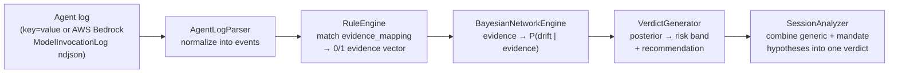

<p align="center">
  
</p>

<h1 align="center">ShadowMandate</h1>

<p align="center">
  A Bayesian-network drift detector for AI agent logs — scored against generic<br/>
  bad-pattern rules <em>and</em> each agent's own declared mandate.
</p>

<p align="center">
  
  
  
</p>

## Table of Contents

- [The Problem: Shadow Users With Root](#the-problem-shadow-users-with-root)
- [Why Bayesian Networks? (No Math Degree Required)](#why-bayesian-networks-no-math-degree-required)
- [Why Take ShadowMandate Seriously](#why-take-shadowmandate-seriously)
- [Related Work](#related-work)
- [How It Works](#how-it-works)
- [Quickstart](#quickstart)
- [Writing a New Generic Hypothesis](#writing-a-new-generic-hypothesis)
- [Writing a New Role](#writing-a-new-role-defining-a-shadow-users-mandate)
- [Data](#data)
- [License](#license)

## The Problem: Shadow Users With Root

**Your AI agents are shadow users.** They hold IAM privilege, call tools,
touch credentials, and route across regions — with none of the accountability
a human identity would carry.

The case that motivates this project: an IAM-investigation agent resetting or
harvesting credentials isn't inherently unusual-looking on its own — a generic
rule set stays quiet on it. It's only a violation because it's outside *that
agent's* declared objective. A shadow user with root and no accountability
doing exactly that, unnoticed, is the failure mode ShadowMandate targets.

## Why Bayesian Networks? (No Math Degree Required)

### The core idea

Forget the formulas for a second — the core idea is something you already do
without thinking about it.

Think about how a doctor reaches a diagnosis. They start with a **base
rate**: how common is this condition in the general population, before any
symptoms are considered? Then, for every symptom they observe, they nudge
their confidence up — weighing a highly specific symptom more heavily than a
vague, common one. And if two suspicious symptoms show up *together*, an
experienced doctor gets more concerned than the two would suggest separately,
because certain combinations point much more specifically at one diagnosis.

That's the entire idea. ShadowMandate just writes it down as three
human-readable numbers per behavior, stored in plain JSON your team edits
directly:

| Term | Doctor analogy | What it means here |
|---|---|---|
| `base` | "How common is this diagnosis, with zero symptoms observed?" | Baseline suspicion with no evidence at all |
| `weight` | "How telling is this one symptom, by itself?" | How much one piece of evidence raises suspicion on its own |
| `boost` | "These two symptoms together are far more specific than either alone." | Extra suspicion when specific evidence combinations co-occur |

### A real walkthrough

Here's the actual config behind the built-in `iam_investigator` mandate rule
(`bn_iam_investigator_mandate_violation.json`) — no invented numbers:

```json
{
  "base": 0.05,
  "credential_reset_or_rotation_weight": 0.55,
  "credential_harvesting_weight": 0.50,
  "credential_reset_or_rotation_and_credential_harvesting_boost": 0.20
}
```

Walk it forward:

1. **No evidence at all** → risk sits at the base rate, **5%**.
2. **Agent resets a password** (`credential_reset_or_rotation` fires) →
   0.05 + 0.55 = **60%**. Already above a typical 50% alert threshold, from
   *one* action.
3. **The same session also bulk-downloads a credential report**
   (`credential_harvesting` fires too) → 0.05 + 0.55 + 0.50 = 1.10, **then**
   the boost kicks in because *both* specific evidence nodes are active:
   +0.20 more. Clamped at 100%, this lands at **100% — CRITICAL**.

That's the whole engine. No hidden layers, no gradient descent — every one of
those numbers is something a security analyst wrote on purpose, and
`BayesianNetworkEngine.explain()` will hand you back exactly this breakdown
for any real verdict, node by node.

### Why this needs less labeled data

Most drift/anomaly detectors that use machine learning need a **training
set** first — often thousands of labeled "this was normal" and "this was an
attack" examples before the model is any good. For this specific problem,
that's a real obstacle, for two reasons:

1. **Violations are rare by design.** If your IAM-investigation agent had
   reset a hundred passwords unnoticed, that's the failure mode you're trying
   to prevent already happening at scale — you can't ethically or practically
   wait to accumulate "enough" historical violations to train on.
2. **Every role is different.** A model trained on one team's agent
   behavior doesn't know that *your* newly-deployed backup-operator agent
   should never call `restore-backup`. Retraining or relabeling per role, per
   team, multiplies the data problem by every role you define.

A Bayesian network sidesteps this because its parameters — `base`, `weight`,
`boost` — don't have to be *learned* from historical data at all. They're
supplied directly by the person who understands the role, the same way a
senior analyst tells a junior one, "if you see X and Y together, that's a 9
out of 10 — escalate it." You can write a brand-new role's mandate on day
one, with zero historical incidents, and it works immediately. As real
incidents happen, you go back and tune the weights — but you were never
blocked waiting to collect them.

### How it compares

| | Hardcoded thresholds | Trained ML / anomaly model | Bayesian network (this project) |
|---|---|---|---|
| Needs labeled attack data before it works | No | Usually yes, often a lot | No — starts from expert judgment |
| Can explain a single verdict | Partially (which threshold tripped) | Rarely (black box) | Yes — full breakdown via `.explain()` |
| Works for a brand-new role, day one | Yes, but blunt (no nuance) | No — needs retraining/relabeling | Yes — write the JSON and run it |
| Improves as real incident data arrives | No | Yes | Yes — tune weights, no retraining pipeline |

To be fair to the alternative: a model trained on millions of real examples
will typically beat hand-set weights at spotting subtle statistical
anomalies nobody thought to encode. What a Bayesian network trades for that
is the thing this project is optimizing for — **zero cold-start and full
auditability** — in exchange for depending on your team's domain judgment
being reasonably good, and staying willing to revisit it.

## Why Take ShadowMandate Seriously

- **It targets a gap generic tools miss.** The whole point isn't "is this
  weird" — it's "is this outside what *this specific agent* is accountable
  for." The IAM-investigator demo in [Quickstart](#quickstart) shows this
  concretely: the mandate hypothesis lands on `CRITICAL` while every generic
  hypothesis on the same log stays at `MEDIUM` or below.
- **Every rule is auditable, plain-text, and version-controlled.** Detection
  logic is JSON your security team writes, reads, and diffs in code review —
  not an API call into a vendor's undocumented model.
- **Zero cold-start.** Deploy detection for a brand-new agent role the same
  day you define it — see [Why this needs less labeled data](#why-this-needs-less-labeled-data).
- **No hard dependencies.** `pgmpy` is optional; without it, the engine falls
  back to a manual formula that's mathematically equivalent — see
  [`bn_engine.py`](agentic_detection/bn_engine.py).
- **Small enough to actually read.** The entire scoring engine is one file
  you can read in a sitting, not a framework you have to trust blindly.
- **MIT licensed, no lock-in.** Fork it, extend it, run it entirely inside
  your own infrastructure against your own logs.

## Related Work

This isn't the first project in the space, and it's worth knowing the
neighbors before you evaluate it:

- **[dedrift](https://dedrift.ai/)** — open-source silent behavioral drift
  detection for AI agents via a canary-suite + statistical-signature approach.
- **[Agent Threat Rules (ATR)](https://github.com/Agent-Threat-Rule/agent-threat-rules)**,
  **AgentSigma**, **[agentshield-ai/sigma-ai](https://github.com/agentshield-ai/sigma-ai)** —
  Sigma-style, YAML-based detection-rule standards for LLM/agent tool-call
  activity, each already positioned as "Sigma for AI agents."
- **Armo** has written about per-agent behavioral baselines ("defining
  normal") as a drift signal, conceptually close to the mandate idea here.

What's different here: rules are scored through a **Bayesian network** (a
human-tunable CPD — base rate + per-evidence weights + interaction boosts,
auditable via `BayesianNetworkEngine.explain()`) rather than pure statistical
or embedding-based drift, and generic + role-mandate rules share **one
identical schema** (`dr_*.json` detection rules + `bn_*.json` BN config)
instead of a separate DSL for each tier. It's a narrower, more specific tool
than the projects above, not a replacement for any of them.

## How It Works



`BayesianNetworkEngine` uses `pgmpy` if it's installed; without it, it falls
back to an equivalent dependency-free closed-form formula, so the module
works out of the box either way. `SessionAnalyzer` runs every applicable
hypothesis — the full generic catalog plus a role's mandate rules — in one
pass, weighting mandate rules higher via a config-driven `session_weight` so
a mandate breach still dominates the overall verdict even when a generic rule
fires alongside it.

## Quickstart

```bash
git clone <this-repo>
cd ShadowMandate

# Role-aware scan: runs all generic hypotheses + the iam_investigator mandate
# rules against a sample session containing both legitimate read-only IAM
# investigation calls and two mandate-violating ones (password reset,
# bulk credential-report download).
python3 detect_drift.py data/raw/iam_investigator_session.ndjson \
    --agent-id iam-agent-01 --role iam_investigator

# Single-hypothesis mode: test one rule in isolation
python3 detect_drift.py data/raw/app.log \
    --agent-id ollama-test --behavior external_connection
```

The role-aware run above lands on `DRIFT_DETECTED / HIGH`, driven by the
`iam_investigator_mandate_violation` hypothesis (posterior 1.00) — while every
individual *generic* hypothesis in the same run stays at MEDIUM or below.
That gap is the point: this is the case a generic-only ruleset misses, and a
role-mandate one catches.

## Writing a New Generic Hypothesis

Add a folder under `hypotheses/generic/<id>/` with a `dr_<id>.json` (evidence
nodes — either substring `patterns` over named `search_fields`, or a numeric/
field-compare `condition`) and a `bn_<id>.json` (base rate + per-node weights +
interaction boosts), then register it in `config/hypothesis.json` under
`generic_behaviors`.

Example: a `bulk_data_export` hypothesis with one pattern-matched node and one
numeric-condition node.

`hypotheses/generic/bulk_data_export/dr_bulk_data_export.json`:

```json
{
  "behavior": "bulk_data_export",
  "description": "Detects an agent exporting data in bulk rather than reading it in place.",
  "references": ["internal"],
  "evidence_mapping": {
    "export_command": {
      "description": "Agent invoked a bulk export/dump command",
      "patterns": ["export-table", "dump database", "bulk-export", "--output csv"],
      "search_fields": ["message", "tool_names"]
    },
    "large_row_count": {
      "description": "Result set size is far beyond a normal interactive query",
      "condition": {"field": "row_count", "operator": "gt", "value": 100000}
    }
  }
}
```

`hypotheses/generic/bulk_data_export/bn_bulk_data_export.json`:

```json
{
  "behavior": "bulk_data_export",
  "evidence_nodes": ["export_command", "large_row_count"],
  "hypothesis_node": "bulk_data_export_drift",
  "cpd_parameters": {
    "base": 0.05,
    "export_command_weight": 0.35,
    "large_row_count_weight": 0.30,
    "export_command_and_large_row_count_boost": 0.20
  }
}
```

Interaction-boost keys must be named `<node1>_and_<node2>_boost`, joining the
exact `evidence_nodes` names the boost requires — that's how `bn_engine.py`
knows which nodes to check together.

Register it in `config/hypothesis.json`:

```json
{
  "id": "bulk_data_export",
  "name": "Bulk Data Export Detection",
  "detection_rules": "hypotheses/generic/bulk_data_export/dr_bulk_data_export.json",
  "bn_config": "hypotheses/generic/bulk_data_export/bn_bulk_data_export.json",
  "output_csv": "hypotheses/generic/bulk_data_export/output.csv",
  "session_weight": 1.0
}
```

## Writing a New Role (Defining a Shadow User's Mandate)

Add `hypotheses/roles/<role_id>/role.json` describing the agent's objective
and in/out-of-scope actions — i.e. what this specific IAM principal is
actually accountable for doing — plus one or more `dr_*.json`/`bn_*.json`
mandate hypotheses in the same folder, then register the role and its
`mandate_behaviors` in `config/hypothesis.json`. See `roles/iam_investigator/`
for a complete example.

Example: a `backup_operator` role whose mandate is "take/verify backups,
never restore or delete one" — one mandate hypothesis per out-of-scope
bullet, in the same order, so the two stay traceable to each other.

`hypotheses/roles/backup_operator/role.json`:

```json
{
  "id": "backup_operator",
  "name": "Backup Operator Agent",
  "objective": "Create and verify scheduled backups. Never restore, delete, or move backup data.",
  "in_scope": [
    "Triggering scheduled backup jobs",
    "Verifying backup integrity/checksums"
  ],
  "out_of_scope": [
    "Restoring or overwriting live data from a backup",
    "Deleting backup snapshots or archives"
  ],
  "owner": "security-team",
  "notes": "This list is descriptive only - it is not read by the engine. Enforcement is the evidence_mapping in dr_backup_operator_mandate_violation.json (one evidence node per out_of_scope bullet, in the same order); update both together."
}
```

`hypotheses/roles/backup_operator/dr_backup_operator_mandate_violation.json`:

```json
{
  "behavior": "backup_operator_mandate_violation",
  "description": "Detects a backup agent restoring/overwriting data or deleting backups - out of scope for a create-and-verify-only role.",
  "references": ["internal"],
  "note": "Each evidence node below is the executable enforcement of the corresponding bullet in role.json's out_of_scope list (same order). Keep both in sync when either changes.",
  "evidence_mapping": {
    "restore_or_overwrite": {
      "description": "Agent restored a backup onto live data",
      "patterns": ["restore-backup", "overwrite live", "restore-database"],
      "search_fields": ["message", "tool_names"]
    },
    "backup_deletion": {
      "description": "Agent deleted a backup snapshot or archive",
      "patterns": ["delete-snapshot", "rm -rf /backups", "delete-backup"],
      "search_fields": ["message", "tool_names"]
    }
  }
}
```

`hypotheses/roles/backup_operator/bn_backup_operator_mandate_violation.json`:

```json
{
  "behavior": "backup_operator_mandate_violation",
  "evidence_nodes": ["restore_or_overwrite", "backup_deletion"],
  "hypothesis_node": "backup_operator_mandate_violation_drift",
  "cpd_parameters": {
    "base": 0.05,
    "restore_or_overwrite_weight": 0.45,
    "backup_deletion_weight": 0.45,
    "restore_or_overwrite_and_backup_deletion_boost": 0.10
  }
}
```

Register the role in `config/hypothesis.json` under `roles`:

```json
{
  "id": "backup_operator",
  "name": "Backup Operator Agent",
  "manifest": "hypotheses/roles/backup_operator/role.json",
  "mandate_behaviors": [
    {
      "id": "backup_operator_mandate_violation",
      "name": "Backup Operator Mandate Violation",
      "detection_rules": "hypotheses/roles/backup_operator/dr_backup_operator_mandate_violation.json",
      "bn_config": "hypotheses/roles/backup_operator/bn_backup_operator_mandate_violation.json",
      "output_csv": "hypotheses/roles/backup_operator/output.csv",
      "session_weight": 2.5
    }
  ]
}
```

Then run it the same way as the built-in role:

```bash
python3 detect_drift.py <log_file> --agent-id backup-agent-01 --role backup_operator
```

## Data

Sample logs under `data/raw/` are drawn from Splunk's publicly available
attack-data dataset, used here for demonstration purposes only.

## License

MIT — see [LICENSE](LICENSE).
